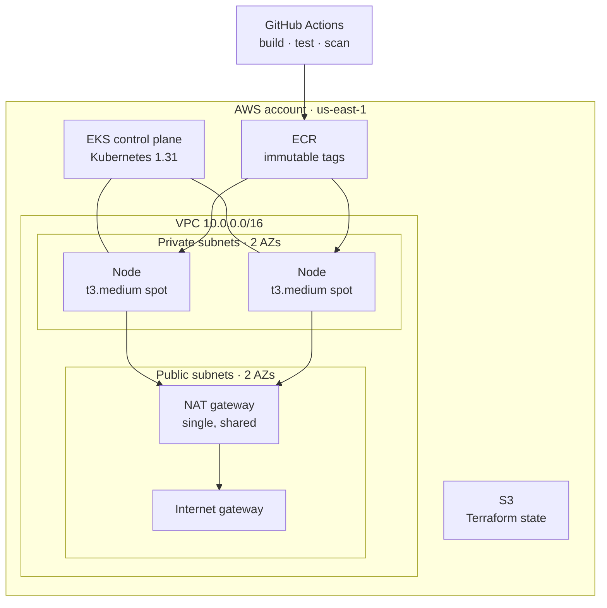

# 01 — EKS Ordering Platform

A microservices ordering backend on AWS EKS, modelled on a quick-service-restaurant digital
ordering platform. Built with Terraform, deployed from ECR, tested and scanned in CI.

## Architecture



Two `menu` pods run one per node, behind a ClusterIP Service. The nodes sit in private subnets
and reach the internet through a single NAT gateway — one rather than one per AZ, which halves
the largest line on the bill at the cost of AZ-level redundancy that a portfolio project does
not need.

## What exists today

| Component | State |
|---|---|
| Terraform: state bucket + budget alarms | Built |
| Terraform: VPC, subnets, NAT, routing | Built |
| Terraform: EKS cluster, managed node group, core addons | Built |
| Terraform: ECR repositories with lifecycle rules | Built |
| `menu` service (Go) + manifests | Built, running |
| CI: build, test, lint, security scan | Built, green |
| `orders`, `payments-mock` services | Not built yet |
| CD: OIDC push to ECR, automated deploy | Not built yet |
| RDS, ArgoCD, Prometheus/Grafana, ingress | Not built yet |

## Layout

```
terraform/
  bootstrap/   state bucket + budget alarms — created once, never destroyed
  network/     VPC, subnets, NAT gateway, routing
  eks/         cluster, managed node group, core addons
  ecr/         one repository per service
app/menu/      Go service, Dockerfile, tests
k8s/           namespace + per-service manifests
docs/          architecture decisions, costs, runbook
```

Each Terraform directory is an independent stack with its own state key. `eks` reads the
network's outputs through `terraform_remote_state` rather than hardcoding subnet IDs.

## Standing it up

Requires Terraform ≥ 1.10, AWS credentials, `kubectl`, and Docker.

```bash
# 1. Once per account — creates the state bucket the other stacks write to
cd terraform/bootstrap && terraform init && terraform apply

# 2. Network, then the cluster (eks depends on network's outputs)
cd ../network && terraform init && terraform apply
cd ../eks     && terraform init && terraform apply    # ~15 min, mostly the control plane
cd ../ecr     && terraform init && terraform apply

# 3. Build and publish the service image
aws ecr get-login-password --region us-east-1 \
  | docker login --username AWS --password-stdin "$(cd terraform/ecr && terraform output -raw registry)"

cd app/menu
REPO="$(cd ../../terraform/ecr && terraform output -json repository_urls | jq -r .menu)"
docker buildx build --platform linux/amd64 -t "${REPO}:$(git rev-parse --short HEAD)" --push .

# 4. Deploy
aws eks update-kubeconfig --name ordering-platform-cluster --region us-east-1
kubectl apply -f k8s/namespace.yaml
kubectl apply -f k8s/menu/
kubectl rollout status deployment/menu -n ordering
```

The image **must** be built for `linux/amd64`. The nodes are amd64, so an image built natively
on an Apple Silicon machine will pull successfully and then crash-loop with `exec format error`.

## Trying it

The Service is ClusterIP — there is no ingress yet, deliberately, since a load balancer costs
more than the rest of the stack combined at this scale.

```bash
kubectl port-forward -n ordering service/menu 8080:80
```

```bash
curl localhost:8080/menu                    # full catalogue
curl 'localhost:8080/menu?category=drinks'  # filtered
curl localhost:8080/menu/burger-double      # one item
curl localhost:8080/healthz                 # liveness
curl localhost:8080/readyz                  # readiness
```

## Tearing down

Destroy in reverse dependency order. `bootstrap` is deliberately left alone — it holds the state
for everything else and its bucket is protected by `prevent_destroy`.

```bash
cd terraform/ecr     && terraform destroy   # force_delete drops images with the repos
cd ../eks            && terraform destroy   # delete node groups first if any failed to create
cd ../network        && terraform destroy
```

## Further reading

- [docs/architecture.md](docs/architecture.md) — why the pieces are shaped this way
- [docs/costs.md](docs/costs.md) — what this costs per hour and where it goes
- [docs/runbook.md](docs/runbook.md) — operations, and the failures hit while building it
