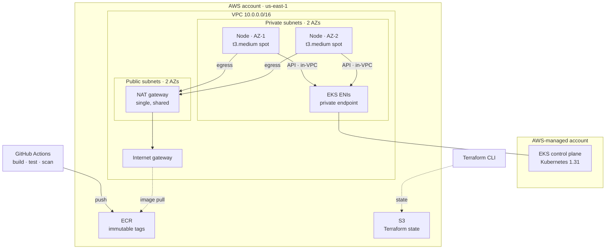

# 01 — EKS Ordering Platform

A microservices ordering backend on AWS EKS, modelled on a quick-service-restaurant digital
ordering platform. Built with Terraform, deployed from ECR, tested and scanned in CI.

## Architecture



Each service runs two pods, one per node, behind a ClusterIP Service. `orders` calls the other
two over cluster DNS. Three details in that diagram are easy to draw wrong and worth stating
plainly:

- **The control plane is not in this VPC.** It runs in an AWS-managed account. What sits in the
  private subnets is a pair of requester-managed ENIs — `describe-network-interfaces` shows them
  owned by this account but requested by an AWS-owned one. Node-to-API traffic reaches the
  control plane through those ENIs and never leaves the VPC.
- **Image pulls leave the VPC and come back.** There are no VPC endpoints here, so a node pulling
  from ECR egresses through the NAT gateway and the internet gateway to ECR's public endpoint.
  That path is metered per GB, which is part of why the image is kept at 8MB.
- **One NAT gateway, shared across both AZs.** One per AZ is the textbook layout; this halves the
  largest line on the bill in exchange for AZ-level redundancy a portfolio project does not need.

## What exists today

| Component | State |
|---|---|
| Terraform: state bucket + budget alarms | Built |
| Terraform: VPC, subnets, NAT, routing | Built |
| Terraform: EKS cluster, managed node group, core addons | Built |
| Terraform: ECR repositories with lifecycle rules | Built |
| `menu`, `orders`, `payments-mock` services (Go) + manifests | Built |
| CI: build, test, lint, security scan | Built, green |
| CD: publish to ECR from CI via OIDC, no stored keys | Built |
| Automated deploy to the cluster | Not built yet — see below |
| RDS, ArgoCD, Prometheus/Grafana, ingress | Not built yet |

## Layout

```
terraform/
  bootstrap/     state bucket + budget alarms — created once, never destroyed
  network/       VPC, subnets, NAT gateway, routing
  eks/           cluster, managed node group, core addons
  ecr/           one repository per service
  github-oidc/   IAM role GitHub Actions assumes to publish images
app/
  cmd/menu/        catalogue
  cmd/orders/      prices from menu, authorizes through payments-mock
  cmd/payments-mock/
  internal/httpx/  JSON, request logging, drain-aware server
  Dockerfile       shared; SERVICE build-arg selects the binary
k8s/             namespace + per-service manifests
docs/            architecture decisions, costs, runbook
```

Each Terraform directory is an independent stack with its own state key. `eks` reads the
network's outputs through `terraform_remote_state` rather than hardcoding subnet IDs.

The services are one Go module rather than three. They share the same HTTP plumbing, and a
single Dockerfile means they cannot drift apart in base image or security posture.

## Standing it up

Requires Terraform ≥ 1.10, AWS credentials, `kubectl`, and Docker.

```bash
# 1. Once per account — creates the state bucket the other stacks write to
cd terraform/bootstrap && terraform init && terraform apply

# 2. Network, then the cluster (eks depends on network's outputs)
cd ../network && terraform init && terraform apply
cd ../eks     && terraform init && terraform apply    # ~15 min, mostly the control plane
cd ../ecr     && terraform init && terraform apply

# 3. Images. CI publishes these on every merge to main, so this is only needed
#    to build from a working tree that has not been pushed.
REGISTRY="$(cd terraform/ecr && terraform output -raw registry)"
aws ecr get-login-password --region us-east-1 \
  | docker login --username AWS --password-stdin "$REGISTRY"

cd app
for service in menu orders payments-mock; do
  docker buildx build --platform linux/amd64 \
    --build-arg "SERVICE=${service}" \
    -t "${REGISTRY}/ordering-platform/${service}:$(git rev-parse --short HEAD)" --push .
done

# 4. Deploy
aws eks update-kubeconfig --name ordering-platform-cluster --region us-east-1
kubectl apply -f k8s/namespace.yaml
kubectl apply -R -f k8s/
kubectl rollout status deployment/orders -n ordering
```

Two things that will bite otherwise:

- Images **must** be built for `linux/amd64`. The nodes are amd64, so an image built natively on
  an Apple Silicon machine pulls successfully and then crash-loops with `exec format error`.
- The manifests pin image tags by commit SHA. Deploying a working tree means updating those
  tags, or the cluster runs whatever that SHA last pointed at.

## Trying it

Every Service is ClusterIP — there is no ingress yet, deliberately, since a load balancer costs
more than the rest of the stack combined at this scale.

```bash
kubectl port-forward -n ordering service/orders 8080:80
```

Placing an order is the interesting path, because `orders` has to reach both other services to
answer: it prices each line from `menu`, then authorizes through `payments-mock`.

```bash
curl -X POST localhost:8080/orders \
  -H 'Content-Type: application/json' \
  -d '{"items":[{"item_id":"burger-classic","quantity":2},
                {"item_id":"fries-regular","quantity":1}]}'
```

```jsonc
{
  "id": "ord_0001",
  "status": "confirmed",
  "total_cents": 2147,   // 899*2 + 349, priced by menu rather than the client
  "payment_id": "pay_0001"
}
```

Worth trying, because each returns something different:

```bash
# Unavailable item -> 409. onion-rings is out of stock in the catalogue.
curl -X POST localhost:8080/orders -H 'Content-Type: application/json' \
  -d '{"items":[{"item_id":"onion-rings","quantity":1}]}'

# Over the decline threshold -> 201, status payment_declined. The order exists;
# the payment did not succeed.
curl -X POST localhost:8080/orders -H 'Content-Type: application/json' \
  -d '{"items":[{"item_id":"burger-double","quantity":50}]}'

# Scale menu to zero, then order -> 502. orders reports the dependency failure
# rather than pretending it priced the line.
kubectl scale deployment/menu -n ordering --replicas=0
```

`menu` and `payments-mock` can be reached the same way, by port-forwarding their own Service.

## Tearing down

Only two stacks cost anything worth reclaiming, and they are the two that get destroyed:

```bash
cd terraform/eks     && terraform destroy   # delete node groups first if any failed to create
cd ../network        && terraform destroy   # NAT gateway lives here
```

**Three stacks stay up deliberately.** Together they cost a few cents a month, and destroying
them breaks things that should keep working while the cluster is gone:

| Stack | Why it stays |
|---|---|
| `bootstrap` | Holds the state for every other stack; its bucket carries `prevent_destroy`. |
| `ecr` | CI publishes an image on every merge to `main`. Destroy this and the pipeline fails on every push until it is re-applied. Storage is $0.10/GB-month against images of a few MB, capped by lifecycle rules. |
| `github-oidc` | The IAM role CI assumes. An IAM role costs nothing, and recreating it means re-verifying the trust policy each time. |

That is the whole rule: **destroy what bills by the hour, keep what bills by the byte.** The
cluster and the NAT gateway are ~$0.18/hr between them; everything else is rounding error.

## How images get published

A push to `main` that passes every check ends with an image in ECR, tagged with the commit SHA.
There are no AWS access keys stored in GitHub: the workflow mints an OIDC token, and an IAM role
whose trust policy accepts exactly one repository on exactly one branch exchanges it for
temporary credentials. `id-token: write` is granted to the publishing job alone.

Deployment is still manual — `kubectl set image`, which the workflow prints in its run summary.
Automating it would mean CI holding credentials to a cluster that is destroyed at the end of
every session, so every run against a torn-down cluster would fail. That belongs with a GitOps
controller that reconciles when the cluster exists, rather than a pipeline step that assumes it.

## Further reading

- [docs/architecture.md](docs/architecture.md) — why the pieces are shaped this way
- [docs/costs.md](docs/costs.md) — what this costs per hour and where it goes
- [docs/runbook.md](docs/runbook.md) — operations, and the failures hit while building it
